# Database & Backend Fundamentals — Complete Notes (Day 1–5)

---

## Day 1 — Why Databases Exist, and MySQL Basics

### 1.1 The Problem With a Plain File

Before using a real database, a project can store all its data inside a simple flat file, such as `data.json`. Every record is written into it as plain text, and the application code opens the file, reads it, changes it, and saves it back every single time something changes.

This looks fine for a small class exercise, but it breaks down in the real world for two separate reasons.

**Problem 1 — Data gets lost when two people save at once (a race condition)**

> **Analogy — Two People Editing the Same Word File**
> Imagine two people open the exact same Word file on their own laptops at the same time. Both make changes and both hit save. Whoever saves last "wins" — the other person's changes are silently thrown away, with no warning and no error message. This is called a **race condition**, and a plain file has no built-in way to prevent it.
>
> A real database behaves like a shared Google Doc instead. Everyone works on the same live copy, changes don't overwrite each other, and nothing gets silently lost.

**Problem 2 — Searching a flat file is slow**

If `data.json` had thousands of records inside it, the application would have to load the *entire* file into memory and loop through every single entry just to find one record. A database is built specifically to avoid this — it can locate the correct record almost instantly, no matter how large the data grows. (This speed comes from a feature called **indexing**, explained later in these notes.)

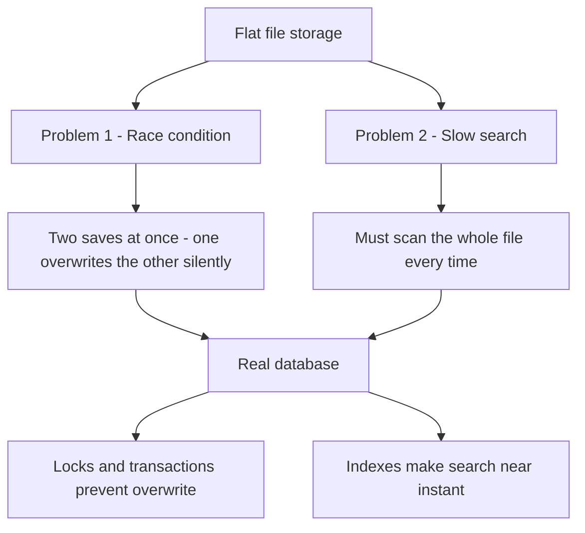

**Conclusion:** a plain file cannot guarantee safety when multiple people write to it, and it cannot search efficiently at scale. A real database solves both problems at once.

---

### 1.2 Installing MySQL Server and MySQL Workbench

Two separate things get installed together:

- **MySQL Server** — the actual database engine. It runs quietly in the background (as a Windows service) and is where the data physically lives.
- **MySQL Workbench** — the GUI tool used to write queries, view tables, and manage the database. It is a window *into* the database, not the database itself.

A root password is set during installation, and it controls who is allowed to connect.

> **Analogy — A Bank**
> MySQL Server is like the secure server room inside a bank where the actual money (the data) is kept — you never walk in and touch it directly. MySQL Workbench is like the ATM screen: an interface where you type instructions ("show balance," "deposit money") without ever entering the server room yourself. The root password is like your ATM PIN — forget it, and you can no longer connect.

---

### 1.3 Creating a Database by Hand

```sql
CREATE DATABASE resume_db;
USE resume_db;
```

- `CREATE DATABASE` makes a brand-new, empty database on the server.
- `USE` tells MySQL which database all the following commands should apply to, so the database name doesn't need to be repeated in every query.

---

### 1.4 The Hierarchy — Server, Database, Table, Row

- A **Server** holds many **Databases**.
- A **Database** holds many **Tables**.
- A **Table** holds many **Rows** (records).

> **Analogy — Nested Folders on a Laptop**
> The **Server** is the whole laptop, running everything in the background. A **Database** (like `resume_db`) is one project folder. A **Table** (like `users` or `resumes`) is a single file inside that folder, similar to one Excel sheet. A **Row** is one line inside that sheet — a single record.

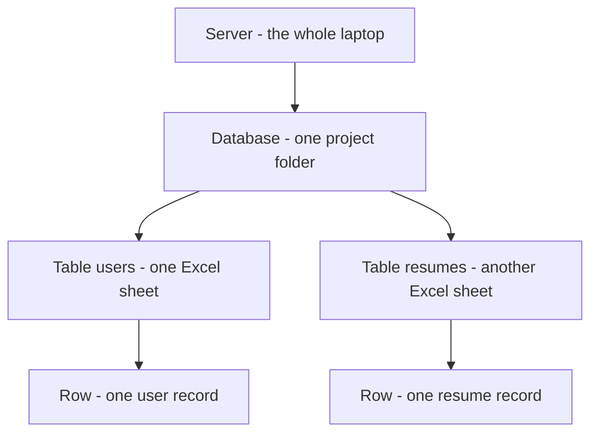

---

### 1.5 Creating the `users` Table

```sql
CREATE TABLE users (
    id INT AUTO_INCREMENT PRIMARY KEY,
    name VARCHAR(45) NOT NULL,
    email VARCHAR(45) NOT NULL UNIQUE
);
```

- `id` — the Primary Key. It auto-increments automatically, so it is never filled in by hand.
- `name` — cannot be left empty (`NOT NULL`).
- `email` — cannot be left empty, and must be unique across the entire table (no two users can share an email).

> **Analogy — College Roll Numbers**
> The `id` is like a roll number the college office assigns automatically — a student never picks their own. `email UNIQUE` works like an Aadhaar number: only one person can ever hold a specific Aadhaar number, so no two users can register with the same email.

---

### 1.6 INSERT, SELECT, and WHERE

```sql
INSERT INTO users (name, email) VALUES ('unishka', 'unishka@gmail.com');
SELECT * FROM users;
SELECT * FROM users WHERE name = 'unishka';
```

> **Analogy — Managing Phone Contacts**
> - `INSERT` = saving a new contact
> - `SELECT` = opening the contact list to look at it
> - `WHERE` = typing a name into the search bar so only that one contact shows up

---

### 1.7 Foreign Keys — Linking a Second Table

```sql
CREATE TABLE resumes (
    id INT AUTO_INCREMENT PRIMARY KEY,
    userId INT NOT NULL,
    tittle VARCHAR(150) NOT NULL,
    FOREIGN KEY (userId) REFERENCES users(id)
);
```

**Foreign Key — Definition:** a column in one table that points to a row in another table. It guarantees the value in that column can only be something that actually exists in the table it references, which stops invalid or "orphan" data from ever being created.

- **Primary Key** = "who am I" — the identity of a row inside its own table.
- **Foreign Key** = "who do I belong to" — a reference to a row in a different table.

> **Analogy — A Food Delivery Order Linked to a Customer**
> A food delivery order has its own Order ID (Primary Key), but it also carries the Customer ID (Foreign Key), so the system always knows *whose* order it is. `resumes.userId` does exactly the same job — it points back to `users.id` to say which user owns that resume.

---

### 1.8 JOIN — Reading Two Tables Together

**Join — Definition:** a query that combines rows from two tables by matching a shared column between them.

```sql
SELECT users.name, users.email, resumes.tittle
FROM resumes
JOIN users ON resumes.userId = users.id;
```

> **Analogy — Matching a Courier Parcel to Its Owner**
> One table has only parcel details (tracking number, item). A second table has only the owner's name and address, also tied to a tracking number. A join means matching both tables *by tracking number*, so it becomes clear which parcel belongs to which person. The data stays safely separate in two tables, but a join brings both sides together the moment it's needed.

---

## Day 2 — RDBMS, SQL vs NoSQL, and Data Types

### 2.1 DBMS vs RDBMS

**DBMS (Database Management System) — Definition:** a general-purpose software system for managing any kind of database, not necessarily one organized into related tables.

**RDBMS (Relational Database Management System) — Definition:** a specialized type of DBMS that organizes data into structured tables with predefined relationships between them, and enforces the ACID properties (Atomicity, Consistency, Isolation, Durability).

| | DBMS (Generic) | RDBMS (Structured) |
|---|---|---|
| Structure | Loose data structure | Strict table-based structure |
| Relationships | Minimal or none | Strong, via Foreign Keys |
| Query language | Varies, not standardized | Standard SQL |
| Integrity | Basic | ACID compliance |
| Example | Plain file database | MySQL, PostgreSQL |

**Where RDBMS comes in:** MySQL is not just a DBMS — it is specifically an RDBMS, because everything learned on Day 1 (tables, primary keys, foreign keys, joins) only exists because MySQL enforces structured relationships between tables. A generic DBMS would not require any of that structure.

> **Analogy — A Library vs a Filing Cabinet**
> A generic DBMS is like a room where books can be stacked however you like. An RDBMS is like a filing cabinet with labeled drawers, cross-reference cards, and a strict rule that every card must point to a folder that actually exists — nothing is allowed to float around unlinked.

---

### 2.2 SQL vs NoSQL

**SQL databases — Definition:** relational databases that store data in structured tables with a predefined schema, enforced before any data goes in.

**NoSQL databases — Definition:** databases that store data in flexible, unstructured or semi-structured formats, without requiring a fixed schema in advance.

| Aspect | SQL | NoSQL |
|---|---|---|
| Data model | Tables (rows and columns) | Documents, key-value pairs, graphs |
| Schema | Fixed, defined up front | Flexible, can change per record |
| Relationships | Foreign keys, joins | Loose references |
| Scaling | Vertical — add power to one server | Horizontal — add more servers |
| Examples | MySQL, PostgreSQL, Oracle | MongoDB, Redis, Cassandra |

### 2.3 Structured vs Unstructured Data

**Structured data — Definition:** data that fits neatly into rows and columns, where every record follows the exact same shape (this is what SQL is built for).

**Unstructured data — Definition:** data that doesn't follow a fixed shape — different records can have different fields, or the data may not be tabular at all (text, images, logs). This is what NoSQL is built for.

> **Analogy — A Printed Form vs a Diary Entry**
> Structured data is like a printed government form — every copy has the same fields, in the same order, and a blank field is obviously missing. Unstructured data is like a diary entry — one day might be three lines, another day three pages with a sketch in the margin. Both are valid data, but only one fits neatly into a table.

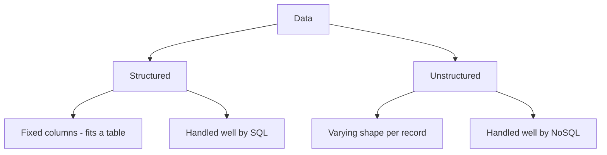

---

### 2.4 CHAR vs VARCHAR vs STRING

**CHAR(size) — Definition:** a fixed-length text column. It always reserves the exact number of character cells specified, no matter how much data is actually stored.

Example — storing "Deepesh" (7 letters) in `CHAR(10)`:
```
D | e | e | p | e | s | h | · | · | ·
= 10 cells always reserved (3 blank spaces added as padding)
```

**VARCHAR(size) — Definition:** a variable-length text column. It stores only the data actually provided, up to the given size limit.

Example — storing "Deepesh" (7 letters) in `VARCHAR(10)`:
```
D | e | e | p | e | s | h
= 7 cells used, no padding
```

**Rule of thumb:**
- Use **CHAR** when every value is exactly the same length — e.g. country codes (always 2 letters), fixed SKU codes.
- Use **VARCHAR** when text length varies — e.g. names, emails, addresses.

**STRING** is not a MySQL type at all — it's the name Sequelize (covered on Day 3) uses in JavaScript code. When a model defines `DataTypes.STRING`, Sequelize converts it into `VARCHAR(255)` in the actual MySQL table. STRING is the JavaScript-side label; VARCHAR is what really gets created in the database.

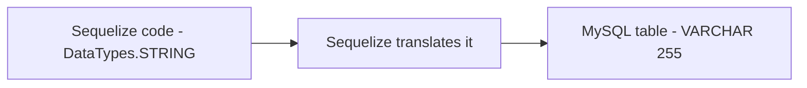

---

### 2.5 Other Data Types — ENUM, TINYINT, BOOLEAN

**ENUM — Definition:** a column that can hold only one value from a predefined list.

```sql
status ENUM('pending', 'active', 'closed')
```

> **Analogy — A Multiple-Choice Question**
> A VARCHAR column is a fill-in-the-blank question — anything can be typed. An ENUM column is a multiple-choice question — a value must be picked from the given options; there is no "other" box.

**TINYINT — Definition:** a very small integer type, typically used to store small numeric ranges. It is commonly used to represent boolean-style flags (0 or 1) in MySQL, since MySQL does not have a dedicated boolean storage type at the engine level.

**BOOLEAN — Definition:** a true/false type. In MySQL, `BOOLEAN` is actually stored internally as `TINYINT(1)` — it is a convenience alias, not a separate physical type. Writing `BOOLEAN` in a table definition is really creating a `TINYINT(1)` column underneath.

> **Analogy — A Light Switch**
> BOOLEAN/TINYINT is like a light switch — it only has two real positions, on or off, true or false. Unlike VARCHAR or ENUM, there's no list of options to choose from — just a binary state.

---

## Day 3 — ORM and Sequelize

### 3.1 What is an ORM?

**ORM (Object-Relational Mapper) — Definition:** a tool that lets code interact with a database using objects and functions in a programming language, instead of writing raw SQL by hand. Sequelize is the ORM used here, and it talks to MySQL underneath.

### 3.2 Why Use Sequelize When SQL Already Works?

Raw SQL works perfectly well — everything on Day 1 was done in plain SQL. So why add an ORM on top of it?

- **Write JavaScript, not SQL strings.** Instead of hand-writing `INSERT INTO ... VALUES (...)`, a model method like `User.create({...})` is called, and Sequelize generates the correct SQL automatically.
- **Safety by default.** Sequelize automatically escapes values passed into queries, which protects against SQL injection without extra manual effort.
- **One definition, reused everywhere.** A model (like `User`) describes the table's shape once. Every part of the application that needs to read or write users reuses that same definition, instead of retyping column names and types in every query.
- **Relationships become simple method calls.** Instead of writing a `JOIN` by hand every time, a relationship like "a user has many resumes" is declared once, and Sequelize handles generating the joins whenever data linked to it is requested.
- **Cross-database portability.** The same Sequelize code can, with a small config change, talk to PostgreSQL or SQLite instead of MySQL, because Sequelize is the layer translating JavaScript into whatever SQL dialect the underlying database needs.

> **Analogy — A Translator at a Meeting**
> Writing raw SQL is like speaking directly in the database's own language, every single time you need something. Sequelize is like hiring a translator who sits in the meeting — you speak plain JavaScript, and the translator converts it into correct, properly-formatted SQL. The output is the same, but it's less error-prone and easier to work with.

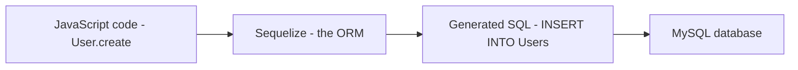

*(The detailed Sequelize setup — `config/database.js`, model files, `associate()` functions, and the full create/read/update walkthrough with actual SQL output — is covered in full in the separate class notes on storing data step by step, and is not repeated here to avoid duplication.)*

---

## Day 4 — Building the Full Database Schema With Sequelize

### 4.1 Model vs Migration

Every table in this project was created using one command per table:

```
npx sequelize-cli model:generate --name User --attributes name:string,email:string
```

Each command creates **two** files at once:

- A **model**, in `models/` — the JavaScript object the application code talks to directly.
- A **migration**, in `migrations/` — the instructions that actually build the real table inside MySQL.

**The difference, explained plainly:** a migration is a one-time instruction — "create a table called `users` with these columns." It is run once, and the table exists after that. A model is how the running application reads and writes rows in that table, every single day afterward.

> **Analogy — Building and Using a Shelf**
> A migration is like the instructions for building a shelf — followed once, and the shelf now physically exists. A model is how items get placed on and taken off that shelf afterward, every day. One command wrote both, already matching each other.

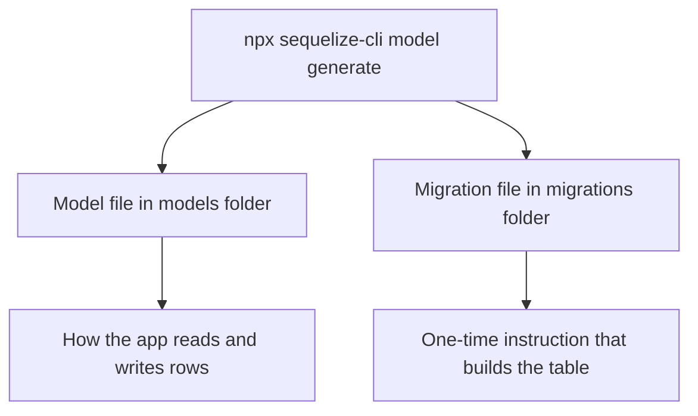

---

### 4.2 The Nine Tables and What Each One Holds

| Table | What it stores | Points to |
|---|---|---|
| users | The account — name, email, password, tier, AI credits | Nothing (top of the tree) |
| templates | A design a resume can use | Nothing |
| documents | One resume or cover letter — the central table | users, templates |
| sections | A block inside a document (e.g. Experience, Skills) | documents |
| items | One line inside a section (e.g. a single job) | sections |
| versions | A saved snapshot of a document | documents |
| applications | A tracked job application | users, documents |
| shares | A public link to a document | documents |
| exports | A generated PDF or DOCX record | documents, users |

Each `model:generate` command specifies the table name and its columns with their types, for example:

```
npx sequelize-cli model:generate --name User \
  --attributes name:string,email:string,password:string,tier:enum:'{free,pro}',aiCredits:integer
```

Sequelize supports several attribute types directly in this command, including `string`, `text`, `integer`, and `enum` — matching the MySQL data types covered on Day 2.

---

### 4.3 How the Tables Connect — The Relationship Structure

The whole database can be thought of as one connected structure, where an arrow points from a table to the table it depends on. For example, a `section` belongs to a `document`, so `sections` points to `documents`.

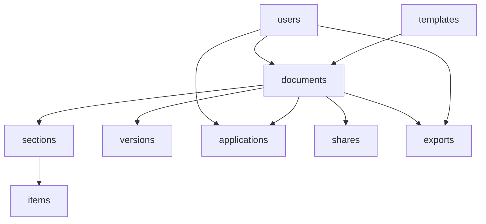

`documents` sits at the center of the schema — almost every other table either points to it directly, or points to something that points to it. `users` sits at the top, since accounts don't depend on anything else in the system.

**Foreign key behavior inside migrations:** a migration for a column like `userId` includes a reference back to its parent table, along with what should happen on update or delete:

```javascript
userId: {
  type: Sequelize.INTEGER,
  references: { model: 'Users', key: 'id' },
  onUpdate: 'CASCADE',
  onDelete: 'CASCADE'
}
```

This is the same `CASCADE` behavior introduced on Day 1 — if a user is deleted, everything referencing that user through `CASCADE` is automatically deleted too, instead of being blocked or left orphaned.

The model files declare the same relationship in JavaScript, using an `associate()` function, for example:

```javascript
Document.belongsTo(models.User, { foreignKey: 'userId' });
Document.hasMany(models.Section, { foreignKey: 'documentId', onDelete: 'CASCADE' });
```

---

### 4.4 Running Migrations

```
npx sequelize-cli db:migrate            # build every table
npx sequelize-cli db:migrate:undo       # undo the last table
npx sequelize-cli db:migrate:undo:all   # undo everything
npx sequelize-cli db:migrate:status     # see what has run
```

Migrations must run in a specific order, not a random one, because tables depending on other tables (like `documents` depending on `users`) need their parent table to already exist first.

---

## Day 5 — Register API, Password Security, and Async JavaScript

### 5.1 The Register API

The register endpoint takes a name, email, and password from the request. It checks that the email is not already in use, saves the new user to the database, and returns a token, so the user is immediately logged in right after signing up — without needing a separate login step.

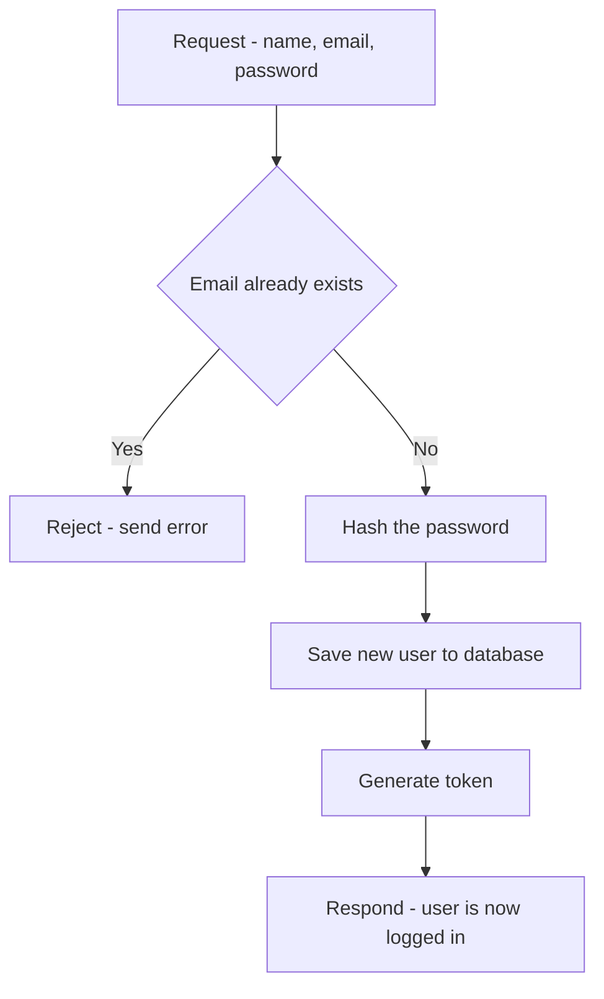

---

### 5.2 Password Encryption

A password is never stored exactly as it was typed. It is hashed first, so what sits in the database is a scrambled string, not the real password.

**Why one-way encryption specifically:** hashing is deliberately one-way. A password can be turned into its scrambled form, but the scrambled form can never be turned back into the original password. Even someone looking directly at the database cannot read anyone's real password.

At login, the newly typed attempt is hashed the same way, and the two scrambled strings are compared — not the two plain passwords. This means that even if a database is ever leaked, it still does not hand over anyone's real password.

> **Analogy — A One-Way Paper Shredder**
> Hashing a password is like feeding a piece of paper into a shredder that always produces the exact same confetti pattern for the exact same original page. Given the confetti, there's no way to reconstruct the original page. But if a new page is shredded and its confetti pattern matches an old one exactly, it proves it was the same original page — without ever needing to see the page itself again.

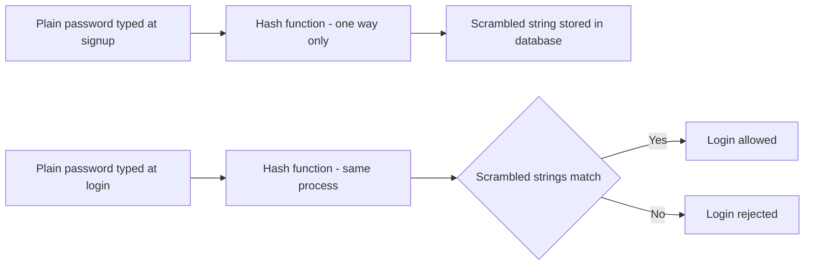

---

### 5.3 Promises

**Promise — Definition:** a way to handle an operation that takes time, such as a database call or a request over the internet, without freezing the rest of the code while waiting. Instead of waiting, the code receives a Promise immediately, and the real result arrives later.

A Promise has three states:
- **Pending** — still waiting for the result
- **Resolved** — the operation succeeded
- **Rejected** — the operation failed

`.then` runs when a Promise resolves successfully. `.catch` runs when a Promise is rejected.

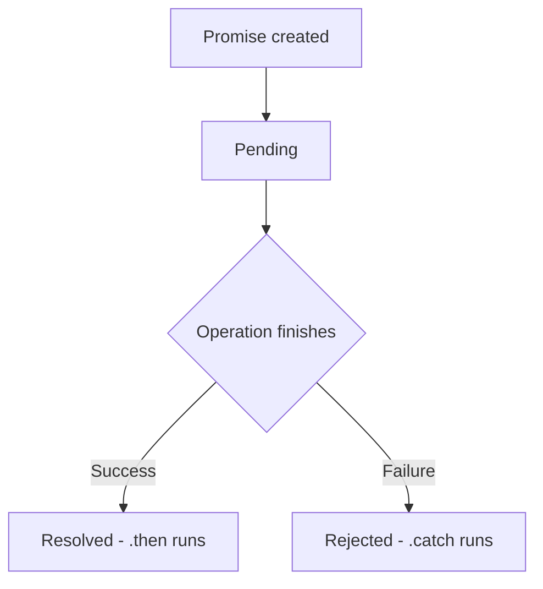

---

### 5.4 Callback Hell

**Callback hell — Definition:** what happens when one slow task depends on the result of another, which depends on another, and each step is handled using nested callback functions. The code keeps nesting deeper and drifting to the right of the screen with every added step, becoming hard to read and even harder to handle errors in.

> **Analogy — A Chain of Nested Boxes**
> Callback hell is like opening a gift box, only to find another wrapped box inside, then another inside that one, and so on. Each layer has to be fully opened before the next one is even visible, and if something goes wrong in the middle, it's unclear which box actually caused the problem.

---

### 5.5 Solving Callback Hell — Promises and Async/Await

**Promises flatten the nesting.** Instead of callbacks nested inside callbacks, a chain of `.then()` calls can be lined up one after another, at the same indentation level.

**Async/await goes a step further.** It lets the slow steps be written as if they run line by line, top to bottom — which reads like ordinary, sequential code, while error handling stays in one single place (a `try/catch` block), rather than being scattered across every nested callback.

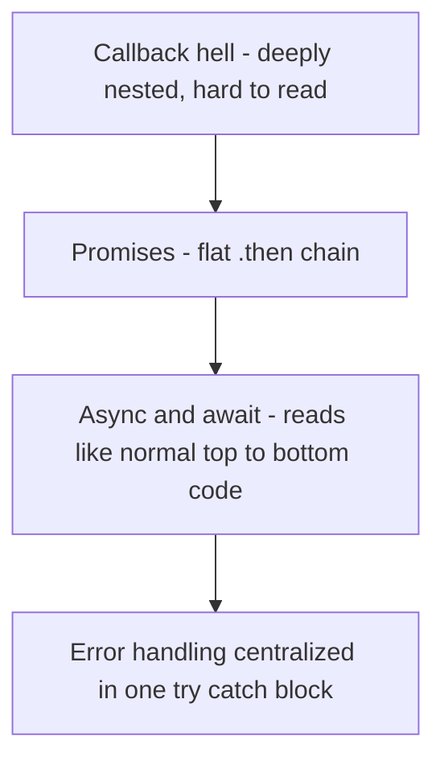

---

## Quick Recap — All 5 Days

| Day | Core topics |
|---|---|
| 1 | Why a plain file fails, installing MySQL, Server/Database/Table/Row hierarchy, creating tables, Primary Key, Foreign Key, JOIN |
| 2 | DBMS vs RDBMS, SQL vs NoSQL, structured vs unstructured data, CHAR vs VARCHAR vs STRING, ENUM, TINYINT, BOOLEAN |
| 3 | What an ORM is, Sequelize, why an ORM is used even though raw SQL already works |
| 4 | model vs migration, the nine-table schema, how tables connect via foreign keys, running migrations |
| 5 | Register API flow, password hashing and why it is one-way, Promises, callback hell, and how Promises/async-await solve it |
