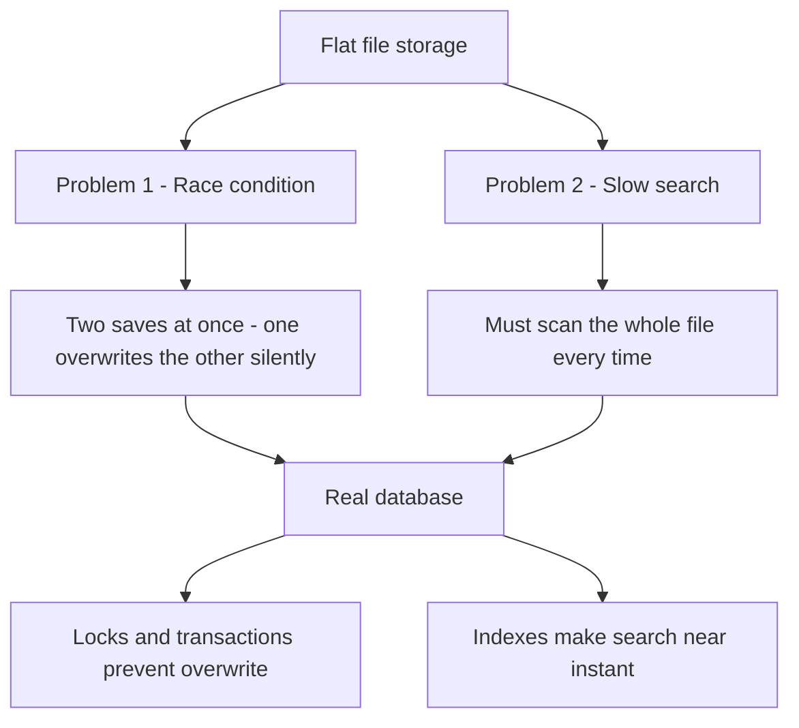
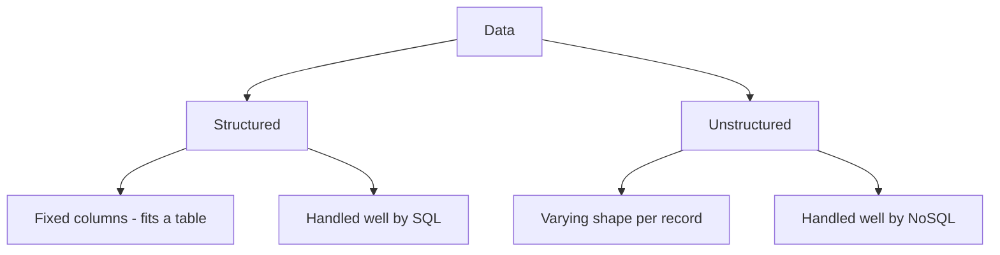
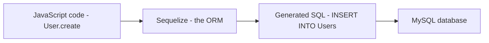
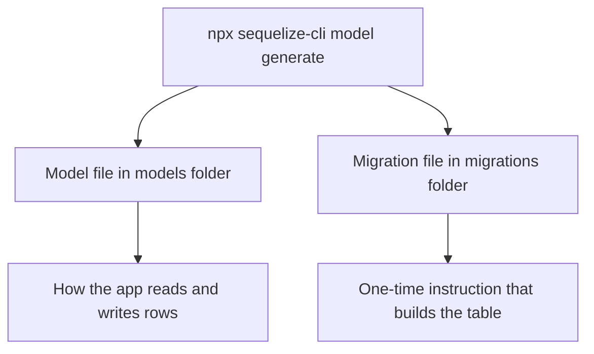
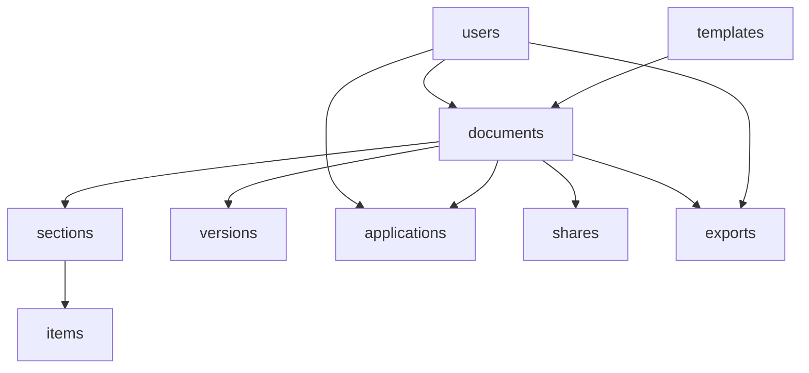
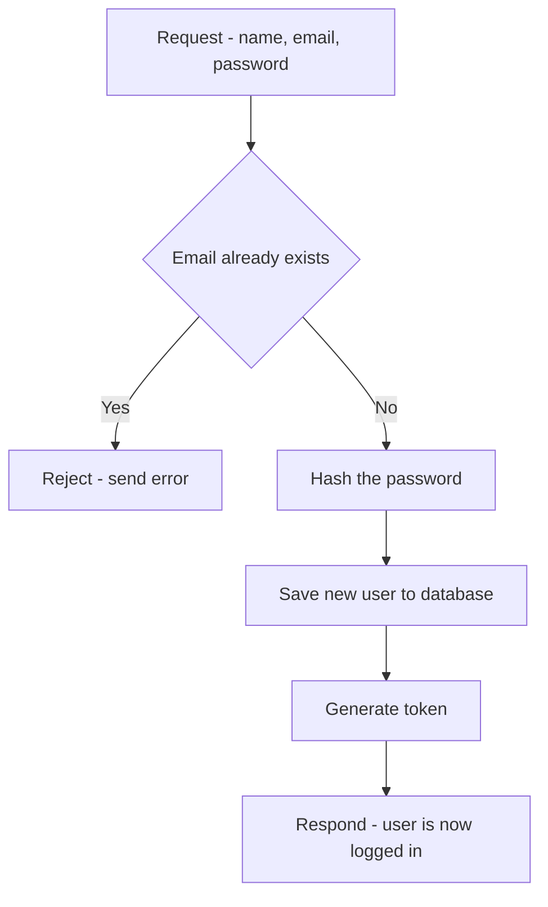
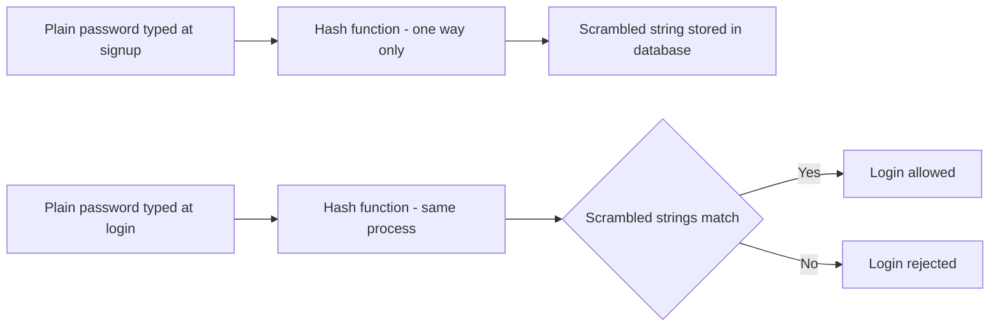
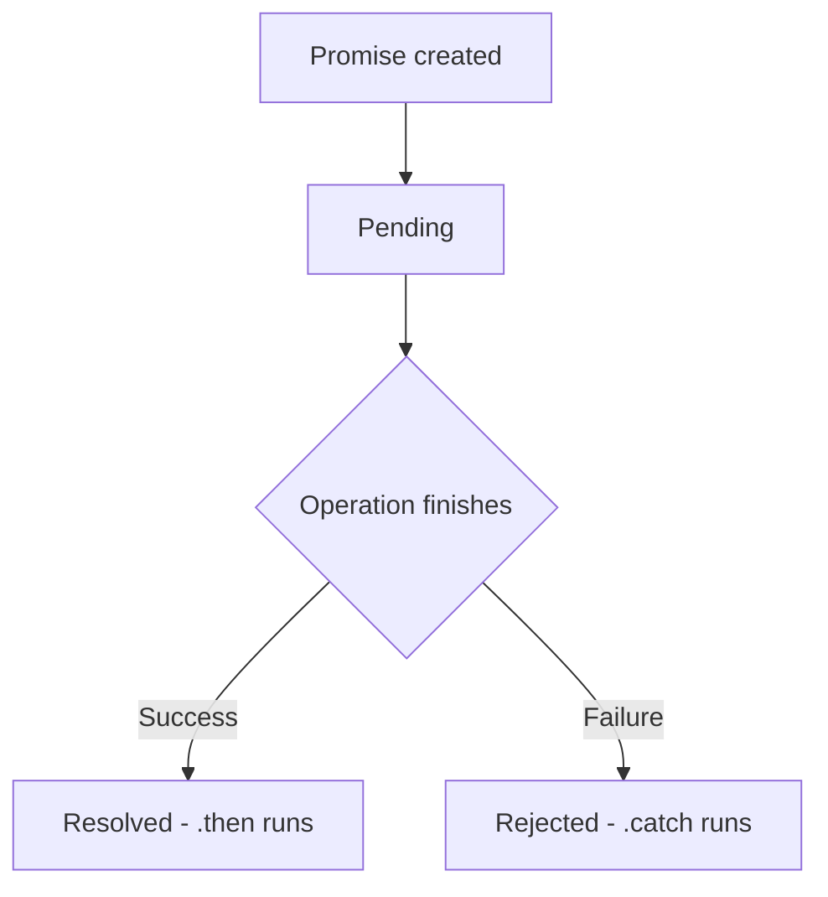
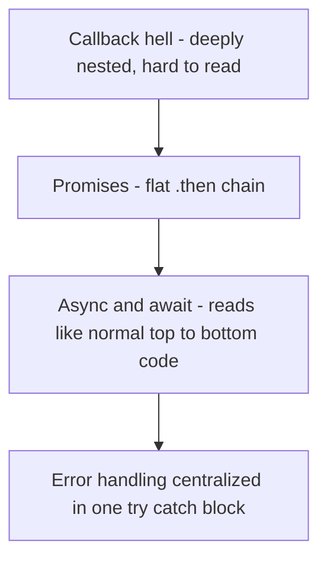

# Database & Backend Fundamentals 

---

## Day 1 — Why Databases Exist, and MySQL Basics

### 1.1 The Problem With a Plain File

Before using a real database, a project can store all its data inside a simple flat file, such as `data.json`. Every record is written into it as plain text, and the application code opens the file, reads it, changes it, and saves it back every single time something changes.

This looks fine for a small class exercise, but it breaks down in the real world for two separate reasons.

**Problem 1 — Data gets lost when two people save at once (a race condition)**

> **Analogy — Two People Editing the Same Word File**
> Imagine two people open the exact same Word file on their own laptops at the same time. Both make changes and both hit save. Whoever saves last "wins" — the other person's changes are silently thrown away, with no warning and no error message. This is called a **race condition**, and a plain file has no built-in way to prevent it.
>
> A real database behaves like a shared Google Doc instead. Everyone works on the same live copy, changes don't overwrite each other, and nothing gets silently lost.

**Problem 2 — Searching a flat file is slow**

If `data.json` had thousands of records inside it, the application would have to load the *entire* file into memory and loop through every single entry just to find one record. A database is built specifically to avoid this — it can locate the correct record almost instantly, no matter how large the data grows. (This speed comes from a feature called **indexing**, explained later in these notes.)



##  Why We Moved Away From `data.json`

Before this, our resume project was storing all its data inside a simple file called `data.json`. It's just a text file — every user and every resume was written inside it as plain text, and our code opened this file, read it, changed it, and saved it back every time.

This worked fine in class, but it breaks in the real world for two reasons:

> **Analogy — Two People Editing the Same Word File**
> Imagine two people open the same Word file on their own laptops at the same time. Both make changes and save. Whoever saves last "wins" — the other person's changes are silently lost, with no warning. This is called a **race condition**, and a plain file cannot stop it.
> A **database** behaves like a shared Google Doc instead — everyone works on the same live copy, changes don't overwrite each other, and nothing gets silently lost.

The second reason is **speed**. If `data.json` had thousands of resumes in it, our code would have to load the entire file and loop through every single entry just to find one record. A database is built specifically to avoid this — it can find the right record almost instantly, no matter how large the data gets.

So we moved the resume project from a text file to a **real MySQL database**.

---

## 1) Installed MySQL Server and MySQL Workbench

- **MySQL Server** = the actual database engine (runs in the background as a Windows service)
- **MySQL Workbench** = the GUI tool used to write queries, view tables, and manage the database
- Set a root password during installation

### what is mySQL
> MySQL Server is like the secure server room inside a bank where all the actual money (data) is kept — you never touch it directly. MySQL Workbench is like the ATM screen — an interface where you give instructions ("show balance," "deposit money") without ever entering the server room yourself. The root password is like your ATM PIN — forget it, and you can't connect anymore.

---

## 2) The Hierarchy: Server → Database → Table → Row

- **Server** → holds many **Databases**
- **Database** → holds many **Tables**
- **Table** → holds many **Rows** (records)

> **Analogy — Folders Inside Folders on Your Laptop**
> Think of it like nested folders. The **Server** is your whole laptop (runs everything in the background). A **Database** (`resume_db`) is one project folder, like an "Internship" folder. A **Table** (`users`, `resumes`) is a file inside that folder, like a separate Excel sheet. A **Row** is one line inside that sheet.

---

## 3) Created a Database

```sql
CREATE DATABASE resume_db;
USE resume_db;
```

---

## 4) Created the `users` Table

```sql
CREATE TABLE users (
    id INT AUTO_INCREMENT PRIMARY KEY,
    name VARCHAR(45) NOT NULL,
    email VARCHAR(45) NOT NULL UNIQUE
);
```

- `id` → Primary Key, auto-increments automatically (don't need to fill it manually)
- `name` → cannot be empty (`NOT NULL`)
- `email` → cannot be empty and must be unique (no two users can have the same email)

> **Analogy — College Roll Numbers**
> The `id` is like a roll number the office assigns automatically (`AUTO_INCREMENT`) — you never pick your own. `email UNIQUE` works like an Aadhaar number: only one person can have a particular Aadhaar number, so no two users can register with the same email.

---

## 5) Inserted Data and Read It Back

Added records using the GUI (Select Rows → Apply) and also learned the SQL way:

```sql
INSERT INTO users (name, email) VALUES ('unishka', 'unishka@gmail.com');
SELECT * FROM users;
SELECT * FROM users WHERE name = 'unishka';
```

> **Analogy — Managing Your Phone Contacts**
> - `INSERT` = saving a new contact
> - `SELECT` = opening your contact list to look at it
> - `WHERE` = typing a name in the search bar so only that contact shows up

**Final `users` table data:**

| id | name    | email               |
|----|---------|---------------------|
| 1  | unishka | unishka@gmail.com   |
| 2  | divyani | divyani@gmail.com   |
| 3  | vijay   | vijay@gmail.com     |
| 4  | manish  | manish@gmail.com    |
| 5  | ishita  | ishita@gmail.com    |


---

## 6) Created a Second Table: `resumes` (with a Foreign Key)

```sql
CREATE TABLE resumes (
    id INT AUTO_INCREMENT PRIMARY KEY,
    userId INT NOT NULL,
    tittle VARCHAR(150) NOT NULL,
    FOREIGN KEY (userId) REFERENCES users(id)
);
```

**Definition — Foreign Key:** A column in one table that points to a row in another table. It ensures the value in that column can only be something that actually exists in the table it references — this stops invalid or "orphan" data from being created.

- `id` → Primary Key of the `resumes` table itself (its own identity)
- `userId` → Foreign Key, points to `users.id` — tells us **which user owns this resume**

**Key concept learned:**
- **Primary Key** = "who am I" (identity of a row in its own table)
- **Foreign Key** = "who do I belong to" (reference to a row in another table)

> **Analogy — Swiggy Order Linked to a Customer ID**
> When you order food on Swiggy, the order has its own Order ID (Primary Key), but it also carries your Customer ID (Foreign Key) — so the system always knows *whose* order it is. `resumes.userId` does the exact same job: it points back to `users.id` to say which user this resume belongs to.

**Final `resumes` table data:**

| id | userId | tittle                 |
|----|--------|------------------------|
| 1  | 1      | software engineer      |
| 2  | 1      | sales manager          |
| 3  | 2      | frontend developer     |
| 4  | 2      | software developer     |
| 5  | 3      | hr                     |
| 6  | 4      | application developer  |
| 7  | 4      | full stack developer   |

*(One user can have multiple resumes — e.g., userId 1 and userId 2 each have two resumes.)*

---

## 7) Learned About ON UPDATE / ON DELETE Rules for Foreign Keys

- **RESTRICT** (default): Prevents deleting/updating a user if related resumes exist — throws an error unless the resumes are removed first
- **CASCADE**: Automatically deletes/updates related resumes when the linked user is deleted/updated

> **Analogy — Deleting a Swiggy Account**
> RESTRICT is like Swiggy refusing to delete your account while you have an active order — it blocks the action until things are cleared up. CASCADE is like deleting your account and Swiggy automatically cancelling every order linked to it, no manual cleanup needed.

---

## 8) JOIN — Reading Two Tables Together

**Definition — Join:** A query that combines rows from two tables by matching a common column between them. Here, `resumes.userId` is matched with `users.id`, so each resume gets paired with the user it belongs to.

```sql
SELECT users.name, users.email, resumes.tittle
FROM resumes
JOIN users ON resumes.userId = users.id;
```

> **Analogy — Matching a Courier Parcel to Its Owner**
> One table only has parcel details (tracking number, item). Another table only has the owner's name and address (also tied to a tracking number). A join means matching both tables **by tracking number** so you can see "this parcel belongs to this person." The data stays safely separate, but a join brings both sides together the moment you need it.

**Result of the JOIN query:**

| name    | email               | tittle                 |
|---------|---------------------|-------------------------|
| unishka | unishka@gmail.com   | software engineer      |
| unishka | unishka@gmail.com   | sales manager          |
| divyani | divyani@gmail.com   | frontend developer     |
| divyani | divyani@gmail.com   | software developer     |
| vijay   | vijay@gmail.com     | hr                     |
| manish  | manish@gmail.com    | application developer  |
| manish  | manish@gmail.com    | full stack developer   |

**Also learned:** without `ORDER BY`, MySQL does **not guarantee** any particular row order. Use `ORDER BY id` (or any column) to control the order explicitly.

---

## 9) Normalization — Store Each Fact Only Once

**Definition — Normalization:** Organizing data so that each fact is stored in exactly one place, instead of repeating it across multiple rows or tables.

> **Analogy — Not Photocopying Your Aadhaar Card Onto Every Form**
> Bad design: copy the user's name and email onto every single resume row. If the user ever changes their email, you'd have to **hunt down and update every resume** — miss one, and your data goes out of sync.
> Good design: store the name and email only once, in the `users` table. The `resumes` table just keeps the `userId`. This is like writing only your Aadhaar number on a form instead of photocopying the whole card each time — the original stays safe in one place, and every form just refers back to it.

**One-liner:** Store each fact once, and link to it with an `id`. Use a join to bring it back together whenever you need it.

---

## 10) Indexing — A Shortcut for Faster Search

**Definition — Index:** A data structure MySQL builds on a column so it can find matching rows quickly, instead of scanning the entire table row by row.

> **Analogy — The Index Page at the Back of a Textbook**
> When you look up a topic in a thick textbook, you don't read the whole book — you check the **index page**, which tells you "this topic is on page 214." A MySQL index works the same way — instead of scanning the entire table, MySQL jumps straight to the right row.

```sql
CREATE INDEX idx_email ON users(email);
```

Indexes help the most with: `WHERE`, `JOIN`, `ORDER BY`, `GROUP BY`.

---

## Quick Recap Table

| Term | One-Line Meaning |
|---|---|
| Database | Organized data storage — like a project folder |
| Table | Rows + columns — like an Excel sheet |
| Primary Key | "Who am I" — unique identity of a row |
| Foreign Key | "Who do I belong to" — link to a row in another table |
| Join | Shows data from two tables together — like matching a parcel to its owner by tracking number |
| Normalization | Store each fact only once — like reusing an Aadhaar number instead of copying it everywhere |
| Indexing | A shortcut for faster search — like a textbook's index page |
| RESTRICT | Blocks deletion if related rows exist |
| CASCADE | Auto-deletes/updates related rows |

---

## What Was Actually Run Today

```sql
CREATE DATABASE resume_db;
USE resume_db;

CREATE TABLE users (
    id INT AUTO_INCREMENT PRIMARY KEY,
    name VARCHAR(45) NOT NULL,
    email VARCHAR(45) NOT NULL UNIQUE
);

INSERT INTO users (name, email) VALUES ('unishka', 'unishka@gmail.com');
SELECT * FROM users;
SELECT * FROM users WHERE name = 'unishka';

CREATE TABLE resumes (
    id INT AUTO_INCREMENT PRIMARY KEY,
    userId INT NOT NULL,
    tittle VARCHAR(150) NOT NULL,
    FOREIGN KEY (userId) REFERENCES users(id)
);

SELECT users.name, users.email, resumes.tittle
FROM resumes
JOIN users ON resumes.userId = users.id;
```

---

## Summary of Today's Learning

- How Server, Database, Table, and Row relate to each other
- Creating databases and tables using SQL
- Difference between Primary Key and Foreign Key
- Inserting and retrieving data (INSERT, SELECT, WHERE, ORDER BY)
- Linking two tables using a Foreign Key relationship
- Using JOIN to combine data from multiple related tables into one result

---
---
### 1.8 JOIN — Reading Two Tables Together

**Join — Definition:** a query that combines rows from two tables by matching a shared column between them.

```sql
SELECT users.name, users.email, resumes.tittle
FROM resumes
JOIN users ON resumes.userId = users.id;
```

> **Analogy — Matching a Courier Parcel to Its Owner**
> One table has only parcel details (tracking number, item). A second table has only the owner's name and address, also tied to a tracking number. A join means matching both tables *by tracking number*, so it becomes clear which parcel belongs to which person. The data stays safely separate in two tables, but a join brings both sides together the moment it's needed.

---

## Day 2 — RDBMS, SQL vs NoSQL, and Data Types

### 2.1 DBMS vs RDBMS

**DBMS (Database Management System) — Definition:** a general-purpose software system for managing any kind of database, not necessarily one organized into related tables.

**RDBMS (Relational Database Management System) — Definition:** a specialized type of DBMS that organizes data into structured tables with predefined relationships between them, and enforces the ACID properties (Atomicity, Consistency, Isolation, Durability).

| | DBMS (Generic) | RDBMS (Structured) |
|---|---|---|
| Structure | Loose data structure | Strict table-based structure |
| Relationships | Minimal or none | Strong, via Foreign Keys |
| Query language | Varies, not standardized | Standard SQL |
| Integrity | Basic | ACID compliance |
| Example | Plain file database | MySQL, PostgreSQL |

**Where RDBMS comes in:** MySQL is not just a DBMS — it is specifically an RDBMS, because everything learned on Day 1 (tables, primary keys, foreign keys, joins) only exists because MySQL enforces structured relationships between tables. A generic DBMS would not require any of that structure.

> **Analogy — A Library vs a Filing Cabinet**
> A generic DBMS is like a room where books can be stacked however you like. An RDBMS is like a filing cabinet with labeled drawers, cross-reference cards, and a strict rule that every card must point to a folder that actually exists — nothing is allowed to float around unlinked.

---

### 2.2 SQL vs NoSQL

**SQL databases — Definition:** relational databases that store data in structured tables with a predefined schema, enforced before any data goes in.

**NoSQL databases — Definition:** databases that store data in flexible, unstructured or semi-structured formats, without requiring a fixed schema in advance.

| Aspect | SQL | NoSQL |
|---|---|---|
| Data model | Tables (rows and columns) | Documents, key-value pairs, graphs |
| Schema | Fixed, defined up front | Flexible, can change per record |
| Relationships | Foreign keys, joins | Loose references |
| Scaling | Vertical — add power to one server | Horizontal — add more servers |
| Examples | MySQL, PostgreSQL, Oracle | MongoDB, Redis, Cassandra |

### 2.3 Structured vs Unstructured Data

**Structured data — Definition:** data that fits neatly into rows and columns, where every record follows the exact same shape (this is what SQL is built for).

**Unstructured data — Definition:** data that doesn't follow a fixed shape — different records can have different fields, or the data may not be tabular at all (text, images, logs). This is what NoSQL is built for.

> **Analogy — A Printed Form vs a Diary Entry**
> Structured data is like a printed government form — every copy has the same fields, in the same order, and a blank field is obviously missing. Unstructured data is like a diary entry — one day might be three lines, another day three pages with a sketch in the margin. Both are valid data, but only one fits neatly into a table.

## Structured vs Unstructured Data

### Structured Data

**Definition:** Data organized in a **predefined format** with a clear structure.

**Characteristics:**
- Organized in tables, rows, and columns
- Follows a fixed schema
- Every record has the same fields
- Easily queryable and searchable
- Predictable format

**Examples:**
- Employee database (consistent columns: name, email, salary, department)
- Customer orders (order ID, customer ID, amount, date)
- Product catalog (product name, price, description, stock)
- Bank transactions (account ID, amount, date, type)

**Storage:**
```sql
-- Example: Employee table (Structured)
CREATE TABLE employees (
  id INT PRIMARY KEY,
  name VARCHAR(100),
  email VARCHAR(100),
  salary DECIMAL(10, 2),
  department VARCHAR(50),
  hireDate DATE
);

-- Every record has exactly these 6 fields
-- All data follows the same structure
```

**Advantages:**
- ✅ Efficient querying and indexing
- ✅ Data consistency guaranteed
- ✅ Easier to validate and constrain
- ✅ Optimal for relationships (joins)
- ✅ Better for reporting and analytics

**Best Used With:** SQL Databases (MySQL, PostgreSQL, Oracle)

---

### Unstructured Data

**Definition:** Data that **doesn't follow a predefined structure** or schema.

**Characteristics:**
- No fixed format or organization
- Flexible schema (or no schema)
- Different records can have different fields
- Text, images, videos, audio
- Harder to search and query
- High volume, variety

**Examples:**
- Social media posts (different users, different content types)
- Log files (varying formats and fields)
- User-generated content (reviews, comments, articles)
- Images and videos
- Email messages
- Customer feedback and surveys

**Storage:**
```javascript
// Example: Social media posts (Unstructured)
// Post 1
{
  userId: 123,
  content: "Just had coffee!",
  timestamp: "2024-01-15T10:30:00Z",
  likes: 45
}

// Post 2 (different structure)
{
  userId: 456,
  content: "Check out this photo",
  image: "https://...",
  timestamp: "2024-01-15T11:00:00Z",
  likes: 200,
  comments: [{ userId: 789, text: "Nice!" }],
  hashtags: ["photography", "nature"]
}

// Post 3 (yet another structure)
{
  userId: 789,
  videoUrl: "https://...",
  duration: 120,
  caption: "Video tutorial",
  views: 1000,
  shares: 50
}

// Each post can have different fields!
```

**Advantages:**
- ✅ Flexible and adaptable to changing requirements
- ✅ Can handle diverse data types
- ✅ Scalable for massive data volumes
- ✅ Fast writes (no schema validation overhead)
- ✅ Good for rapid development (iterate quickly)

**Disadvantages:**
- ❌ Harder to query and search
- ❌ No guaranteed data consistency
- ❌ More complex to analyze
- ❌ Storage overhead (stores field names with every record)

**Best Used With:** NoSQL Databases (MongoDB, DynamoDB, Cassandra)

---

### Structured vs Unstructured: Comparison

| Aspect | Structured | Unstructured |
|--------|-----------|--------------|
| **Format** | Fixed, predefined | Flexible, varying |
| **Schema** | Strict schema required | No fixed schema |
---

---



---

### 2.4 CHAR vs VARCHAR vs STRING

**CHAR(size) — Definition:** a fixed-length text column. It always reserves the exact number of character cells specified, no matter how much data is actually stored.

Example — storing "Deepesh" (7 letters) in `CHAR(10)`:
```
D | e | e | p | e | s | h | · | · | ·
= 10 cells always reserved (3 blank spaces added as padding)
```

**VARCHAR(size) — Definition:** a variable-length text column. It stores only the data actually provided, up to the given size limit.

Example — storing "Deepesh" (7 letters) in `VARCHAR(10)`:
```
D | e | e | p | e | s | h
= 7 cells used, no padding
```

**Rule of thumb:**
- Use **CHAR** when every value is exactly the same length — e.g. country codes (always 2 letters), fixed SKU codes.
- Use **VARCHAR** when text length varies — e.g. names, emails, addresses.

**STRING** is not a MySQL type at all — it's the name Sequelize (covered on Day 3) uses in JavaScript code. When a model defines `DataTypes.STRING`, Sequelize converts it into `VARCHAR(255)` in the actual MySQL table. STRING is the JavaScript-side label; VARCHAR is what really gets created in the database.


---

### 2.5 Other Data Types — ENUM, TINYINT, BOOLEAN

*
### Specialized MySQL Data Types

#### ENUM

**Definition:** A column that can hold **only one value from a predefined list**.

**Syntax:**
```sql
ENUM('value1', 'value2', 'value3')
```

**Example:**
```sql
CREATE TABLE posts (
  id INT PRIMARY KEY,
  title VARCHAR(255),
  status ENUM('active', 'pending', 'deleted')
);
```

**Use Cases:**
- ✅ Status fields (active, inactive, pending, archived)
- ✅ Category fields with fixed options
- ✅ Role fields (admin, user, guest)

**Advantages:**
- Prevents invalid data entry
- Keeps data consistent
- MySQL will reject any value not in the list
- Space-efficient (stored as integer internally)

**Example in Sequelize:**
```javascript
const Post = sequelize.define('Post', {
  title: DataTypes.STRING,
  status: DataTypes.ENUM('active', 'pending', 'deleted'),
});
```

---

#### BOOLEAN

**Definition:** A true/false column for yes-or-no questions.

**Typical Usage Examples:**
- `isVerified` — Is the user email verified?
- `termsAccepted` — Did the user accept terms?
- `isActive` — Is the account active?
- `isPremium` — Is the user a premium subscriber?

**In Sequelize:**
```javascript
const User = sequelize.define('User', {
  email: DataTypes.STRING,
  isVerified: DataTypes.BOOLEAN,      // false by default
  termsAccepted: DataTypes.BOOLEAN,   // false by default
  isActive: DataTypes.BOOLEAN,         // true by default
});
```

**Storage:**
- MySQL stores BOOLEAN as TINYINT(1)
- `true` = 1
- `false` = 0

---

#### TINYINT

**Definition:** A very small integer column (takes up minimal space).

**Range:**
- Signed: -128 to 127
- Unsigned: 0 to 255

**Use Cases:**
- User ratings (1-5 stars)
- Small counts
- Flags (0 or 1)
- Small age ranges

**Example:**
```sql
CREATE TABLE ratings (
  id INT PRIMARY KEY,
  stars TINYINT,  -- Stores 1-5
  helpful TINYINT  -- Stores 0 or 1 (like BOOLEAN)
);
```

**Storage Benefit:**
- TINYINT uses only 1 byte
- INT uses 4 bytes
- Important when storing millions of records

---

## Day 3 — ORM and Sequelize

### 3.1 What is an ORM?

**ORM (Object-Relational Mapper) — Definition:** a tool that lets code interact with a database using objects and functions in a programming language, instead of writing raw SQL by hand. Sequelize is the ORM used here, and it talks to MySQL underneath.

### 3.2 Why Use Sequelize When SQL Already Works?

Raw SQL works perfectly well — everything on Day 1 was done in plain SQL. So why add an ORM on top of it?

- **Write JavaScript, not SQL strings.** Instead of hand-writing `INSERT INTO ... VALUES (...)`, a model method like `User.create({...})` is called, and Sequelize generates the correct SQL automatically.
- **Safety by default.** Sequelize automatically escapes values passed into queries, which protects against SQL injection without extra manual effort.
- **One definition, reused everywhere.** A model (like `User`) describes the table's shape once. Every part of the application that needs to read or write users reuses that same definition, instead of retyping column names and types in every query.
- **Relationships become simple method calls.** Instead of writing a `JOIN` by hand every time, a relationship like "a user has many resumes" is declared once, and Sequelize handles generating the joins whenever data linked to it is requested.
- **Cross-database portability.** The same Sequelize code can, with a small config change, talk to PostgreSQL or SQLite instead of MySQL, because Sequelize is the layer translating JavaScript into whatever SQL dialect the underlying database needs.

> **Analogy — A Translator at a Meeting**
> Writing raw SQL is like speaking directly in the database's own language, every single time you need something. Sequelize is like hiring a translator who sits in the meeting — you speak plain JavaScript, and the translator converts it into correct, properly-formatted SQL. The output is the same, but it's less error-prone and easier to work with.


---
---


### ORM Architecture

```
┌──────────────────────────────────────────────────────┐
│         Your JavaScript Application                  │
│  (Objects, functions, business logic)                │
└──────────────────────────┬───────────────────────────┘
                           │
                    Uses objects/models
                           │
┌──────────────────────────▼───────────────────────────┐
│            ORM (Sequelize)                           │
│  Translates JS objects → SQL queries                 │
│  Translates SQL results → JS objects                 │
└──────────────────────────┬───────────────────────────┘
                           │
                  Executes SQL queries
                           │
┌──────────────────────────▼───────────────────────────┐
│         Database (MySQL, PostgreSQL, etc.)           │
│  Stores data in tables                               │
└──────────────────────────────────────────────────────┘
```

---

### What is Sequelize?

**Sequelize** is a **popular ORM for Node.js** that makes working with SQL databases easier.

**Key Features:**
- Works with multiple databases (MySQL, PostgreSQL, SQLite, MSSQL)
- Write database models in JavaScript
- Automatic SQL query generation
- Data validation and constraints
- Associations (relationships between models)
- Migrations (version control for database structure)

---

### Sequelize in Action

#### Without ORM (Raw SQL)

```javascript
// You have to write SQL strings manually
const result = await connection.query(
  "SELECT * FROM users WHERE id = ? AND email = ?",
  [userId, userEmail]
);

// Converting results to JavaScript objects manually
const user = {
  id: result[0].id,
  name: result[0].name,
  email: result[0].email,
  created_at: result[0].created_at
};
```

**Problems:**
- 🔴 Writing SQL strings by hand (error-prone)
- 🔴 Manual result conversion
- 🔴 Hard to validate SQL at development time
- 🔴 Repetitive code
- 🔴 SQL injection risks if not careful

---

#### With Sequelize ORM

```javascript
// Define your model (JavaScript object)
const User = sequelize.define('User', {
  id: {
    type: DataTypes.INTEGER,
    primaryKey: true,
    autoIncrement: true,
  },
  name: DataTypes.STRING,
  email: DataTypes.STRING,
  createdAt: DataTypes.DATE,
});

// Query using JavaScript methods (not SQL strings!)
const user = await User.findByPk(userId);
// Sequelize automatically generates: SELECT * FROM users WHERE id = ?

// Or with conditions
const user = await User.findOne({
  where: { id: userId, email: userEmail }
});
// Sequelize generates: SELECT * FROM users WHERE id = ? AND email = ?

// Result is automatically a JavaScript object
console.log(user.name);     // Direct property access
console.log(user.email);    // Type-safe
```

**Advantages:**
- ✅ Write JavaScript, not SQL strings
- ✅ Automatic type safety
- ✅ Query validation at development time
- ✅ Less repetitive code
- ✅ Built-in security against SQL injection
- ✅ Results are JavaScript objects automatically

---

### Sequelize Key Concepts

#### 1. Models

A **model** is a JavaScript representation of a database table.

```javascript
const User = sequelize.define('User', {
  // Column definitions
  id: {
    type: DataTypes.INTEGER,
    primaryKey: true,
    autoIncrement: true,
  },
  email: {
    type: DataTypes.STRING,
    allowNull: false,
    unique: true,
  },
  name: DataTypes.STRING,
  isActive: {
    type: DataTypes.BOOLEAN,
    defaultValue: true,
  },
  role: DataTypes.ENUM('admin', 'user', 'guest'),
});

// Now you can use User to query the database
```

---

#### 2. Associations (Relationships)

Define relationships between models.

```javascript
// One-to-Many: One user has many posts
User.hasMany(Post);
Post.belongsTo(User);

// Many-to-Many: Users and projects
User.belongsToMany(Project, { through: 'UserProject' });
Project.belongsToMany(User, { through: 'UserProject' });

// Usage in queries
const userWithPosts = await User.findOne({
  where: { id: userId },
  include: [Post]  // Automatically joins the posts table
});
```

**Sequelize generates the complex SQL JOIN automatically!**

---

#### 3. Queries

```javascript
// CREATE
const newUser = await User.create({
  email: 'john@example.com',
  name: 'John Doe',
  role: 'user'
});

// READ - Single record
const user = await User.findByPk(1);

// READ - Multiple records
const allUsers = await User.findAll({
  where: { isActive: true }
});

// UPDATE
await user.update({ name: 'Jane Doe' });

// DELETE
await user.destroy();
```

**All of this is translated to SQL by Sequelize!**

---
---


## Day 4 — Building the Full Database Schema With Sequelize

### 4.1 Model vs Migration

Every table in this project was created using one command per table:

```
npx sequelize-cli model:generate --name User --attributes name:string,email:string
```

Each command creates **two** files at once:

- A **model**, in `models/` — the JavaScript object the application code talks to directly.
- A **migration**, in `migrations/` — the instructions that actually build the real table inside MySQL.

**The difference, explained plainly:** a migration is a one-time instruction — "create a table called `users` with these columns." It is run once, and the table exists after that. A model is how the running application reads and writes rows in that table, every single day afterward.

> **Analogy — Building and Using a Shelf**
> A migration is like the instructions for building a shelf — followed once, and the shelf now physically exists. A model is how items get placed on and taken off that shelf afterward, every day. One command wrote both, already matching each other.



---

### 4.2 The Nine Tables and What Each One Holds

| Table | What it stores | Points to |
|---|---|---|
| users | The account — name, email, password, tier, AI credits | Nothing (top of the tree) |
| templates | A design a resume can use | Nothing |
| documents | One resume or cover letter — the central table | users, templates |
| sections | A block inside a document (e.g. Experience, Skills) | documents |
| items | One line inside a section (e.g. a single job) | sections |
| versions | A saved snapshot of a document | documents |
| applications | A tracked job application | users, documents |
| shares | A public link to a document | documents |
| exports | A generated PDF or DOCX record | documents, users |

Each `model:generate` command specifies the table name and its columns with their types, for example:

```
npx sequelize-cli model:generate --name User \
  --attributes name:string,email:string,password:string,tier:enum:'{free,pro}',aiCredits:integer
```

Sequelize supports several attribute types directly in this command, including `string`, `text`, `integer`, and `enum` — matching the MySQL data types covered on Day 2.

---

### 4.3 How the Tables Connect — The Relationship Structure

The whole database can be thought of as one connected structure, where an arrow points from a table to the table it depends on. For example, a `section` belongs to a `document`, so `sections` points to `documents`.



`documents` sits at the center of the schema — almost every other table either points to it directly, or points to something that points to it. `users` sits at the top, since accounts don't depend on anything else in the system.

**Foreign key behavior inside migrations:** a migration for a column like `userId` includes a reference back to its parent table, along with what should happen on update or delete:

```javascript
userId: {
  type: Sequelize.INTEGER,
  references: { model: 'Users', key: 'id' },
  onUpdate: 'CASCADE',
  onDelete: 'CASCADE'
}
```

This is the same `CASCADE` behavior introduced on Day 1 — if a user is deleted, everything referencing that user through `CASCADE` is automatically deleted too, instead of being blocked or left orphaned.

The model files declare the same relationship in JavaScript, using an `associate()` function, for example:

```javascript
Document.belongsTo(models.User, { foreignKey: 'userId' });
Document.hasMany(models.Section, { foreignKey: 'documentId', onDelete: 'CASCADE' });
```

---

### 4.4 Running Migrations

```
npx sequelize-cli db:migrate            # build every table
npx sequelize-cli db:migrate:undo       # undo the last table
npx sequelize-cli db:migrate:undo:all   # undo everything
npx sequelize-cli db:migrate:status     # see what has run
```

Migrations must run in a specific order, not a random one, because tables depending on other tables (like `documents` depending on `users`) need their parent table to already exist first.

---

## Day 5 — Register API, Password Security, and Async JavaScript

### 5.1 The Register API

The register endpoint takes a name, email, and password from the request. It checks that the email is not already in use, saves the new user to the database, and returns a token, so the user is immediately logged in right after signing up — without needing a separate login step.



---

### 5.2 Password Encryption

A password is never stored exactly as it was typed. It is hashed first, so what sits in the database is a scrambled string, not the real password.

**Why one-way encryption specifically:** hashing is deliberately one-way. A password can be turned into its scrambled form, but the scrambled form can never be turned back into the original password. Even someone looking directly at the database cannot read anyone's real password.

At login, the newly typed attempt is hashed the same way, and the two scrambled strings are compared — not the two plain passwords. This means that even if a database is ever leaked, it still does not hand over anyone's real password.

> **Analogy — A One-Way Paper Shredder**
> Hashing a password is like feeding a piece of paper into a shredder that always produces the exact same confetti pattern for the exact same original page. Given the confetti, there's no way to reconstruct the original page. But if a new page is shredded and its confetti pattern matches an old one exactly, it proves it was the same original page — without ever needing to see the page itself again.



---

### 5.3 Promises

**Promise — Definition:** a way to handle an operation that takes time, such as a database call or a request over the internet, without freezing the rest of the code while waiting. Instead of waiting, the code receives a Promise immediately, and the real result arrives later.

A Promise has three states:
- **Pending** — still waiting for the result
- **Resolved** — the operation succeeded
- **Rejected** — the operation failed

`.then` runs when a Promise resolves successfully. `.catch` runs when a Promise is rejected.



---

### 5.4 Callback Hell

**Callback hell — Definition:** what happens when one slow task depends on the result of another, which depends on another, and each step is handled using nested callback functions. The code keeps nesting deeper and drifting to the right of the screen with every added step, becoming hard to read and even harder to handle errors in.

> **Analogy — A Chain of Nested Boxes**
> Callback hell is like opening a gift box, only to find another wrapped box inside, then another inside that one, and so on. Each layer has to be fully opened before the next one is even visible, and if something goes wrong in the middle, it's unclear which box actually caused the problem.

---

### 5.5 Solving Callback Hell — Promises and Async/Await

**Promises flatten the nesting.** Instead of callbacks nested inside callbacks, a chain of `.then()` calls can be lined up one after another, at the same indentation level.

**Async/await goes a step further.** It lets the slow steps be written as if they run line by line, top to bottom — which reads like ordinary, sequential code, while error handling stays in one single place (a `try/catch` block), rather than being scattered across every nested callback.



---
---

# Day 6 — Authentication, JWT Tokens, and npm Versioning

## What we covered today

- Building the register, login, and reset password flow
- Why passwords are never stored as plain text
- What a JWT token actually is, and its three parts
- How `jwt.verify` protects a route
- What `~` and `^` mean in `package.json` versions

---

## 6.1. The Big Picture — Authentication Flow

Think of authentication like a building with a security desk. When you join, you get an ID card (register). Every time you come back, you show your ID card and they check it matches their records (login). If you lose your old ID and need a new one, the office issues you a fresh one and cancels the old one (reset password).

```
        ┌───────────┐        ┌───────────┐        ┌────────────────┐
        │  REGISTER │──────► │   LOGIN   │──────► │ RESET PASSWORD │
        └───────────┘        └───────────┘        └────────────────┘
        create account       verify identity        issue new password,
        hash password        issue new token         old one stops working
        issue token
```

Let's go through each step.

---

## 6.2. Register — Creating an Account

```js
function register(name, email, password) {
  if (users.find(u => u.email === email))
    throw new Error('Email already registered');

  const hash = bcrypt.hashSync(password, 10); // one-way, never store plain
  const user = { id: nextId(), name, email, password: hash };
  users.push(user);

  const token = jwt.sign({ id: user.id }, SECRET, { expiresIn: '7d' });
  return { id: user.id, name, email, token };
}
```

Step by step:
1. Check if the email is already registered — if it is, stop right there.
2. Hash the password using `bcrypt` — this scrambles it into something unreadable.
3. Save the user with the hashed password (never the plain one).
4. Issue a token immediately, so the user is logged in right away, without needing to log in separately after registering.

```
register("Himanshu", "h@x.com", "mypassword")
        ↓
{ id: 1, name: 'Himanshu', email: 'h@x.com', token: 'eyJhbGciOiJIU...' }
```

---

## 6.3. Login — Verifying Identity

```js
function login(email, password) {
  const user = users.find(u => u.email === email);
  if (!user || !bcrypt.compareSync(password, user.password))
    throw new Error('Invalid credentials');

  const token = jwt.sign({ id: user.id }, SECRET, { expiresIn: '7d' });
  return { token };
}
```

Login doesn't store or compare plain passwords. Instead, it takes the password you typed, hashes it the same way, and checks if the two hashes match using `bcrypt.compareSync`.

```
login(correct password) → token issued
login(wrong password)   → rejected: "Invalid credentials"
```

Notice: a fresh token is issued every time you log in. Tokens aren't permanent — they expire (`expiresIn: '7d'` means 7 days), which is why logging in again gives you a new one.

---

## 6.4. Reset Password — Replacing the Old Hash

```js
function resetPassword(email, newPassword) {
  const user = users.find(u => u.email === email);
  if (!user) throw new Error('User not found');

  user.password = bcrypt.hashSync(newPassword, 10); // hash the new one too
  return { message: 'Password updated' };
}
```

This simply overwrites the stored hash with a new one. There's no "going back" — the old password's hash is gone.

```
Before reset: stored hash matches OLD password
      ↓
resetPassword(email, newPassword)
      ↓
After reset:
  old password → rejected: "Invalid credentials"
  new password → works
```

---

## 6.5. Why Passwords Are Hashed (Not Stored as-Is)

Imagine a hash like a paper shredder. Once you shred a document, you can't reconstruct the original from the shredded pieces — but if you shred a second copy of the exact same document, you get the exact same shredded pattern. That's exactly how `bcrypt.hashSync` works: it turns "mypassword123" into something like:

```
$2b$10$KR0tMiO/l6JH51Bipc3EPuWnSvA9q6QxRx5lR59WI3YuCCvNJ8Smu
```

You can never turn that string back into the original password. So how does login work? Simple — when you type your password again, it gets shredded the same way, and the app just checks if the two shredded outputs match (`bcrypt.compareSync`). Nobody, not even the developers, can look at the database and read your actual password.

```
Login attempt password → hash it → compare with stored hash
                                       ↓
                          match?  ──── yes ──► logged in
                                  └─── no  ──► "Invalid credentials"
```

---

## 6.6. JWT Tokens — What's Actually Inside

A JWT (JSON Web Token) is just a string made of **three parts joined by dots**:

```
header.payload.signature
```

Think of it like a sealed envelope with a wax stamp. Anyone can open the envelope and read what's inside (the payload isn't encrypted, just encoded) — but if someone tries to alter the letter inside and reseal it, the wax stamp (signature) won't match anymore, and it's obvious it was tampered with.

### The three parts, decoded:

**HEADER** — tells you the type of token and algorithm used
```json
{ "alg": "HS256", "typ": "JWT" }
```

**PAYLOAD** — the actual data stored in the token
```json
{ "id": 5, "role": "student", "iat": ..., "exp": ... }
```

**SIGNATURE** — a scrambled string created using your secret key
```
QWWHS6sXqBYOHMTtPQm5JJ0imJ95FfNUmsgdfCIQGGg
```

**Important:** anyone who has the token can decode and read the payload — it's not secret, just encoded. That's why we never put sensitive data (like passwords) inside a JWT payload. Only the signature can't be faked, because it needs the secret key to generate.

---

## 6.7. `jwt.verify` — Protecting a Route

```js
jwt.verify(token, SECRET)
```

This one line does all the security work. It checks whether the signature actually matches the header + payload, using the secret key.

```
verify(real, untouched token)  → success → user: Himanshu
verify(changed token)          → rejected: "invalid signature"
```

If even a single character in the token is changed, the signature won't match anymore, and `jwt.verify` will reject it immediately. This is what protects every route that requires a logged-in user — the server doesn't need to look anything up in a database; it just checks if the signature is valid.

```
Request comes in with a token
        ↓
jwt.verify(token, SECRET)
        ↓
   ┌────┴────┐
 valid     invalid/tampered
   │             │
allow          reject
access         request
```

---

## 6.8. npm Versioning — Understanding `~` and `^`

A version number follows the pattern:

```
MAJOR . MINOR . PATCH
  4   .  17   .  21
```

- **MAJOR** — big changes, might break old code
- **MINOR** — new features, but shouldn't break old code
- **PATCH** — small bug fixes only

In `package.json`, the symbol in front of the version tells npm how much it's *allowed* to auto-update when installing.

```json
"express": "^4.17.21"
```

| Symbol | Example | Allows |
|---|---|---|
| *(no symbol)* | `4.17.21` | Only exactly `4.17.21` |
| `~` (tilde) | `~4.17.21` | Patch updates only → `4.17.21`, `4.17.22` |
| `^` (caret) | `^4.17.21` | Minor + patch updates → `4.17.22`, `4.18.0`, `4.99.9` — **never** `5.0.0` |

Think of it like a leash on a dog:
- **No symbol** = dog is tied tight, can't move at all — always the exact same version.
- **Tilde (`~`)** = short leash — dog can only wander a little (patch updates).
- **Caret (`^`)** = longer leash — dog can roam more freely (minor + patch updates), but can never cross into the next yard (major version), because a major version could introduce breaking changes.

```
^4.17.21 allows:
   4.17.21 ✅
   4.17.22 ✅ (patch)
   4.18.0  ✅ (minor)
   4.99.9  ✅ (still within major version 4)
   5.0.0   ❌ (major jump — blocked)
```

This was verified using npm's own semver tool — confirming that neither `~` nor `^` ever crosses into a new major version on their own.

---

## Summary Flow

```
Register → hash password → issue token
        ↓
Login → compare hash → issue new token
        ↓
Reset Password → replace old hash → old password stops working


JWT = header.payload.signature
  → payload is readable by anyone (never store secrets there)
  → signature proves it hasn't been tampered with
  → jwt.verify checks the signature before trusting the token


npm versions = MAJOR.MINOR.PATCH
  → no symbol  = exact version only
  → ~ (tilde)  = patch updates only
  → ^ (caret)  = minor + patch updates, never major
```

That's authentication, tokens, and versioning — the pieces that quietly protect almost every backend app running today. 🔐

---
---

# Day 7 — Callbacks in Node.js, and How to Escape Callback Hell

## What we covered today

- What a callback is, and where we use them (files, database, API, timers, user actions)
- Error-first callbacks — the pattern real Node.js follows
- Callback hell — and why the nesting happens
- Fix 1: Breaking steps into named functions
- Fix 2: Promises with `.then`
- Fix 3: `async` and `await`
- Best practices for writing callbacks

---

## 7.1. What is a callback?

In simple words — **a callback is a function that we pass into another function, so that it can be called back once that function finishes its work.**

Think of it like this: you place an order at a restaurant. The waiter doesn't bring your food instantly — they go to the kitchen, place the order, and once it's ready, they come back and tell you ("Order ready!"). You just sit and wait, and only once the work is done do you get notified. That's exactly what a callback does in code.

```js
function orderFood(callback) {
  console.log("Ordered food");
  callback();
}

orderFood(function() {
  console.log("Eat!");
});
```

Here, `orderFood` does its own work, and at the end it calls `callback()` to say — "my part is done, now go ahead and do yours."

### Where are callbacks used?

- **Working with files** — like reading or writing a file (the file system is slow, results don't come instantly)
- **Database queries** — data takes time to come back from a database
- **API calls** — waiting for a response over the internet takes time
- **Timers** — like `setTimeout`, which does something after a fixed delay
- **User actions** — like what happens when a button is clicked

In all these cases, the work doesn't finish immediately — it takes some time. A callback tells the program, "once this task is done, run this function."

---

## 7.2. Error-First Callbacks (Node.js's real pattern)

Node.js follows a convention where **the first argument of a callback is always reserved for the error**. If something goes wrong, the error shows up in that first argument. If everything went fine, the first argument is `null` and the second argument is the actual result.

Think of it like someone calling you and saying — "Hey, is there a problem or not?" If there's a problem, they'll tell you the problem first. If not, they'll say "all good" and then give you the result.

```js
function readFile(name, callback) {
  if (!name) {
    return callback("No file name given"); // error first
  }
  callback(null, "File contents here"); // null = no error, then result
}

readFile("notes.txt", function(error, data) {
  if (error) {
    console.log("Error:", error);
  } else {
    console.log("Got:", data);
  }
});
```

This same pattern repeats everywhere — whether it's reading a file, dividing two numbers, or finding a user in a database:

```js
function findUser(id, callback) {
  if (!id) {
    return callback("No id given");
  }
  callback(null, { name: "Himanshu" });
}

findUser(5, function(error, user) {
  if (error) {
    console.log("Error:", error);
  } else {
    console.log("User:", user.name);
  }
});
```

**Key takeaway:** always check for `error` first, only then use the result. This prevents a lot of bugs.

---

## 7.3. Callback Hell — and why it happens

When we need to run multiple steps one after another, and each step's result is needed for the next step, we end up nesting callbacks inside one another. For example:

```js
function wake(cb) { console.log("Wake"); cb(); }
function brush(cb) { console.log("Brush"); cb(); }
function bath(cb) { console.log("Bath"); cb(); }

wake(function() {
  brush(function() {
    bath(function() {
      console.log("Ready!");
    });
  });
});
```

This looks like a simple morning routine — wake up, brush, bathe, get ready. But in code, it creates a **triangle-shaped structure** — a function inside a function, inside another function.

This is called **Callback Hell** — when callbacks get nested inside callbacks so many times that the code becomes hard to read, indentation keeps drifting to the right, and handling errors also becomes complicated.

To visualize the flow:

```
wake()
  └── brush()
        └── bath()
              └── "Ready!"
```

The more steps you add, the deeper the nesting gets — and the messier the code looks.

---

## 7.4. Fix 1 — Use Named Functions (remove the nesting)

The simplest solution — instead of nesting callbacks inside each other, turn every step into its **own separate named function**, and have one function call the next directly.

```js
function wake() { console.log("Wake"); brush(); }
function brush() { console.log("Brush"); bath(); }
function bath() { console.log("Bath"); done(); }
function done() { console.log("Ready!"); }

wake(); // one call kicks off the whole chain
```

There's no triangle-shaped nesting here — each function does its job and calls the next one. The flow is the same:

```
wake() → brush() → bath() → done()
```

But now the code is flat and much easier to read. This is a small fix, though — it's not enough for deeper nesting in more complex real-world flows (like API calls or database operations). For those, we need better tools: **Promises**.

---

## 7.5. Fix 2 — Promises with `.then`

A **Promise** is an object that represents "there's no result right now, but in the future it will either succeed (resolve) or fail (reject)."

Think of it like ordering something online and getting a tracking number. You don't have the item yet, but there's a promise that "once it's ready, you'll get it." You track that promise — if it's delivered successfully (resolve), great; if something goes wrong (reject), you'll know.

```js
function cook() {
  return new Promise(function(resolve) {
    resolve("Food ready");
  });
}

cook().then(function(result) {
  console.log(result);
});
```

Here, `cook()` returns a Promise. `resolve("Food ready")` says the task completed successfully, and the result is "Food ready". `.then()` catches that result and does something with it.

The advantage of Promises is that they can be **chained** — one `.then()` after another, without deep nesting. This solves the triangle-shaped problem from before.

---

## 7.6. Fix 3 — `async` and `await`

`async`/`await` is built on top of Promises, but it's an even simpler way to write things — it makes the code **look just like normal, step-by-step code**, like a plain list of instructions, without chaining `.then()`.

Think of it this way: `.then()` chaining is like saying "once this happens, then do that, then after that do this" — all joined into one long sentence. `async/await` is like writing plain instructions — "first do this. Then do that. Then the next step." Much more natural and simple to read.

```js
function makeTea() {
  return new Promise(function(resolve) {
    resolve("Tea ready");
  });
}

async function serveTea() {
  const result = await makeTea();
  console.log(result);
}

serveTea();
```

Here, `await` inside an `async` function means — "pause here until `makeTea()`'s result comes back, then move on." This lets the code be read straight, top-to-bottom, just like a normal function — even though under the hood it's still using Promises.

---

## Quick Comparison — All Three Fixes

| Fix | What it does | When to use it |
|---|---|---|
| Named functions | Removes nesting by creating flat functions | Simple, small flows |
| Promises (`.then`) | Handles results through chaining | When you have multiple async steps and need chaining |
| `async`/`await` | Makes Promises look like normal, plain code | When you want clean, readable code — most preferred in modern Node.js |

---

